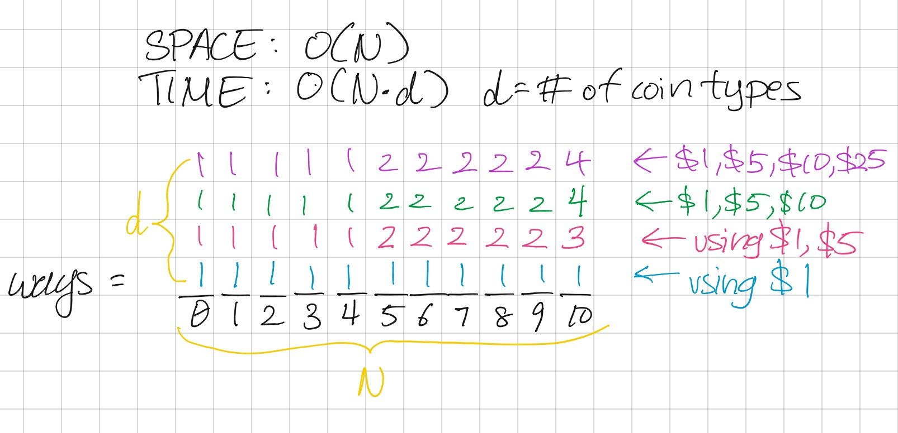

You are given coins of different denominations and a total amount of money. Write a function to compute the number of combinations that make up that amount. You may assume that you have infinite number of each kind of coin.
 
```
Input: amount = 5, coins = [1, 2, 5]
Output: 4
Explanation: there are four ways to make up the amount:
5=5
5=2+2+1
5=2+1+1+1
5=1+1+1+1+1
Example 2:
```

```
Input: amount = 3, coins = [2]
Output: 0
Explanation: the amount of 3 cannot be made up just with coins of 2.
```

```
Input: amount = 10, coins = [10] 
Output: 1

```
 
**Note:**
You can assume that
* 0 <= amount <= 5000
* 1 <= coin <= 5000
* the number of coins is less than 500
* the answer is guaranteed to fit into signed 32-bit integer

## DP Solution
